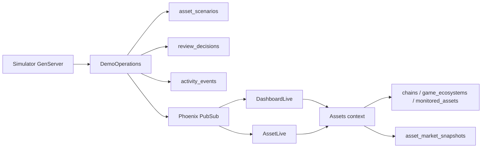

# AssetMonitoringDash

AssetMonitoringDash is a Phoenix LiveView demo for a cross-chain game asset risk
cockpit. It is intentionally local-first: the data is fictional, deterministic,
and shaped to demonstrate fullstack product work rather than production finance.

## What this demo shows

The project is meant to demonstrate a full-stack Phoenix system, not just a
static dashboard:

* Ecto migrations and Postgres-backed catalog data.
* SQL-backed asset filtering, sorting, pagination, and dashboard summaries.
* Persisted operator workflow through an append-only review decision log.
* Persisted scenario overlays that change risk/value projections.
* A supervised simulator process that emits activity and scenario ticks.
* PubSub updates that refresh both the dashboard and asset detail LiveViews.
* Credo, Dialyzer, and focused tests around UI, contexts, persistence, and
  runtime behavior.

## Running locally

To start the Phoenix server:

* Run `mix setup` to install and setup dependencies
* Start Phoenix endpoint with `mix phx.server` or inside IEx with `iex -S mix phx.server`

Now you can visit [`localhost:4000`](http://localhost:4000) from your browser.

## Runtime architecture

The simulator is supervised with the application. It owns the live demo cadence:
manual ticks, automatic ticks, pause/resume state, scenario cadence, and runtime
status. Scenario ticks go through `AssetMonitoringDash.DemoOperations`, so the
same product rule applies whether a price shock is triggered manually from an
asset detail page or automatically by the simulator.

When a price-shock scenario is applied:

1. `asset_scenarios` stores the adjusted projection.
2. `activity_events` records the scenario event.
3. Any stale operator review is reset in `review_decisions`.
4. A review-reset activity event is recorded.
5. PubSub broadcasts the resulting state to LiveViews.
6. Dashboard metrics/table/feed and matching asset detail pages refresh without
   a page reload.

## Persistence model

The app uses Postgres as the primary runtime boundary for the demo catalog and
operator workflow.

* `chains`, `game_ecosystems`, and `monitored_assets` hold the seeded asset
  catalog.
* `asset_market_snapshots` stores historical values used by detail-page trends.
* `asset_scenarios` stores active demo overlays such as price shocks.
* `review_decisions` is an append-only audit log for operator review state.
* `activity_events` stores seeded narrative events plus generated scenario and
  operator events.

Primary keys are UUIDs generated by Ecto schemas. Friendly route IDs such as
`asset-001` are compatibility/demo IDs resolved at the context boundary.

Mutable demo state can be reset without reseeding the catalog via
`AssetMonitoringDash.DemoOperations.reset_mutable_state/0`.

The dashboard also exposes this as **Reset runtime** in the simulator panel. It
clears scenario overlays, review decisions, and generated events while keeping
the seeded catalog and seeded narrative events intact.

APIs are intentionally deferred for now. The current goal is to demonstrate a
database-backed LiveView workflow first: queryable catalog data, SQL summaries,
scenario persistence, review/audit persistence, and a persisted activity feed.

## Learn more

* Official website: https://www.phoenixframework.org/
* Guides: https://hexdocs.pm/phoenix/overview.html
* Docs: https://hexdocs.pm/phoenix
* Forum: https://elixirforum.com/c/phoenix-forum
* Source: https://github.com/phoenixframework/phoenix
