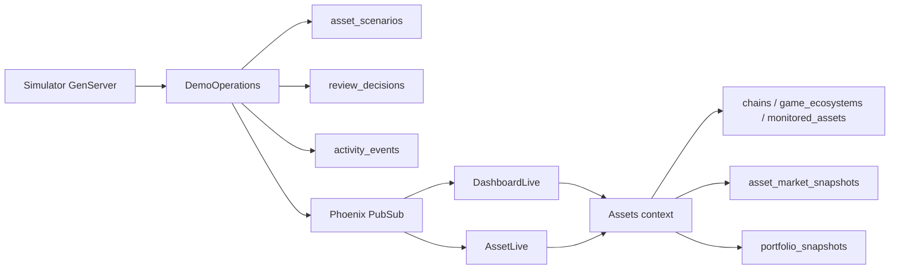
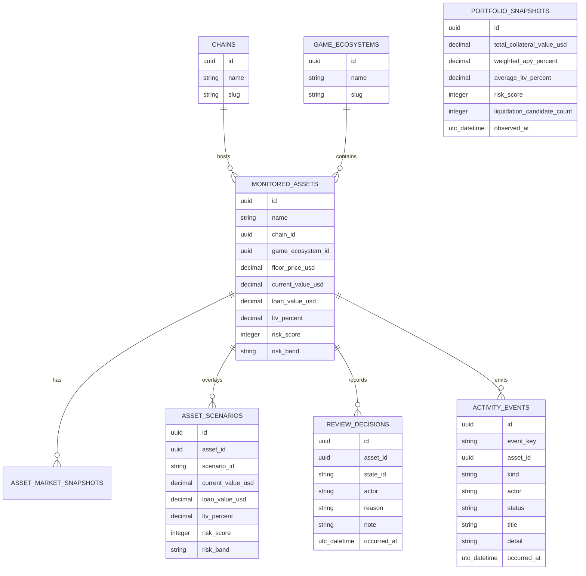

# Asset Risk Cockpit

Asset Risk Cockpit is a Phoenix LiveView demo for monitoring fictional
cross-chain game assets used as loan collateral. It is built as a portfolio
project to show fullstack product work: database modeling, realtime LiveView
state, operator workflows, analytics charts, and a repeatable demo narrative.

The data is intentionally local, deterministic, and fictional. The goal is not
to model production DeFi risk exactly. The goal is to make a realistic operating
surface where one backend event can move a dashboard, an asset detail page, an
audit trail, and portfolio analytics at the same time.

## Portfolio Signal

This project is designed to demonstrate:

- Phoenix LiveView UI with streamed tables, URL-backed filters, tabs, hooks, and
  realtime updates.
- Ecto and Postgres persistence for catalog data, scenarios, events, review
  decisions, market snapshots, and portfolio snapshots.
- A supervised simulator process that writes scenario and activity events.
- Product-grade separation between system recommendation, risk state, operator
  review state, and audit history.
- ECharts integration through LiveView hooks for dashboard and asset charts.
- Reusable UI primitives for cards, tables, buttons, filters, tabs, badges,
  charts, panels, tooltips, and theme switching.
- Credo, Dialyzer, and focused LiveView/context/component tests.

## Product Story

The dashboard answers a simple operational question:

> Which pledged game assets need attention, why, and what did the operator do
> about them?

The main flow is:

1. Start from a seeded Postgres catalog of chains, game ecosystems, assets, and
   market snapshots.
2. Run a simulator scenario tick.
3. Persist a scenario overlay, activity event, and review-state reset.
4. Watch the dashboard cards, charts, event feed, and asset table update.
5. Drill into the impacted asset.
6. Record an operator decision.
7. Open the activity tab to see the persisted audit trail.
8. Reset runtime state and replay the story.

The guided walkthrough in the app is intentionally presenter-friendly: it gives
an interview reviewer a path through the full stack without needing to know the
code first.

## Current Features

- Dashboard metric cards for collateral value, loans, APY, and risk.
- Full-width, scrollable asset table with server-side filtering, sorting,
  pagination, chain icons, active filter chips, and URL sharing.
- Multiselect filters with search, icons, keyboard-friendly behavior, and
  click-outside close.
- Dashboard analytics with ECharts:
  - portfolio value trend,
  - portfolio risk trend,
  - liquidation pressure distribution,
  - recent event volume by source.
- Supervised simulator with event ticks, scenario ticks, pause/resume, runtime
  reset, and scenario cap handling.
- Asset detail page with overview, activity, and related tabs.
- Asset-level trend chart, risk drivers, position metrics, scenario controls,
  review form, review history, and related assets.
- Light, dark, and system theme selection.
- Presenter mode with a dashboard-to-detail story path and reset/replay action.

## Tech Stack

- Elixir and Phoenix 1.8
- Phoenix LiveView 1.1
- Ecto SQL and PostgreSQL
- Tailwind CSS v4
- ECharts
- Credo
- Dialyxir
- ExUnit and LiveViewTest

## Running Locally

Prerequisites:

- Elixir and Erlang/OTP
- PostgreSQL available on `localhost`
- Node dependencies are installed through the Phoenix asset pipeline

Setup:

```bash
mix setup
```

Start the app:

```bash
mix phx.server
```

Then open:

```text
http://localhost:4000
```

Useful commands:

```bash
mix ecto.reset
mix test
mix precommit
```

`mix precommit` runs compile warnings, unused dependency checks, formatting,
Credo, the test suite, and Dialyzer.

## Demo Script

For a concise walkthrough, use the in-app **Demo story** panel:

1. Click **Reset runtime**.
2. Click **Run scenario tick**.
3. Open analytics or feed from the walkthrough.
4. Click the impacted asset link.
5. Review the asset's risk drivers and recommendation.
6. Click **Mark reviewed** or **Escalate**.
7. Open the audit trail.
8. Click **Reset and replay**.

The longer presentation script lives in
[docs/portfolio_presentation.md](docs/portfolio_presentation.md).

## Architecture



The simulator is supervised by the application. Scenario ticks go through
`AssetMonitoringDash.DemoOperations`, so manual and automated scenarios share
the same business operation.

When a scenario is applied:

1. `asset_scenarios` stores the active projection.
2. `activity_events` records the scenario event.
3. Stale operator review state is reset through `review_decisions`.
4. A review-reset event is recorded.
5. PubSub broadcasts the state change.
6. Dashboard and relevant asset detail LiveViews refresh.

## Persistence Model



Catalog data is seeded from `priv/repo/seeds.exs`. Mutable runtime data can be
reset without reseeding:

- `asset_scenarios`
- `review_decisions`
- generated `activity_events`

This makes the demo repeatable while still showing real persistence.

## Design Notes

The UI is intentionally closer to an operator cockpit than a marketing page:

- dense but readable tables,
- explicit status and filter chips,
- restrained cards and panels,
- consistent dark/light theme tokens,
- product-specific dashboard components separated from generic UI primitives.

The component split is:

- `lib/asset_monitoring_dash_web/components/ui` for generic UI primitives,
- `lib/asset_monitoring_dash_web/live/dashboard_live/components` for dashboard
  product components,
- `lib/asset_monitoring_dash_web/live/asset_live/components` for asset-detail
  product components.

## Testing and Quality

The suite includes tests for:

- dashboard rendering, filtering, sorting, event feed, scenarios, and charts,
- asset detail rendering, activity filters, review workflow, related assets, and
  scenario behavior,
- pure modules such as URL state, formatters, recommendation logic, money
  helpers, simulator behavior, and chart option builders,
- reusable UI components.

Run the full quality gate with:

```bash
mix precommit
```

## Deliberate Scope

The app does not currently integrate external market APIs. That is deliberate.
The current portfolio signal is a local-first Phoenix system with strong data
modeling, persistence, realtime behavior, and product UX. External ingestion can
be added later behind provider behaviours once the core workflow is complete.
